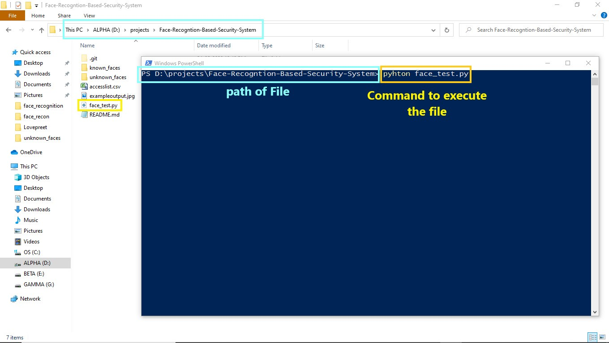
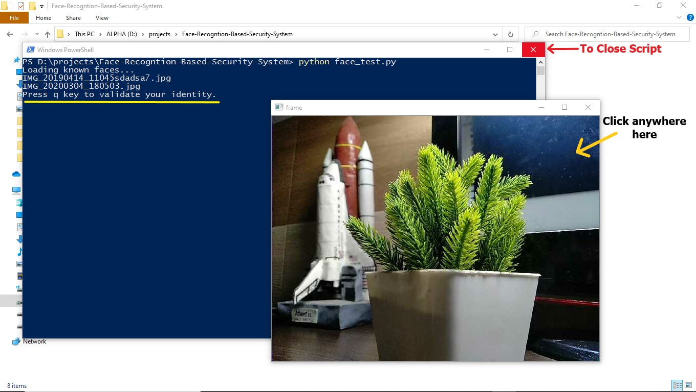

# Face-Recognition-Based-Security-System

This project is based on Python's OpenCV library which does the work of computer vision. In this project a Opencv is set up to detect Human faces and recognising them as an individual person by showing their names also. The machine learning model is trained by providing some pictures of that person and our machine recognzse the face in real time using Webcam or any related camera device and shows the name by drawing a rectangle on the face.   


## Required Libraries 
1. cv2                ``` 
                      pip install opencv-python
                      ```
2. face_recognition   ```
                      pip install face-recognition
                      ```
3. pandas             ```
                      pip install pandas
                      ```
4. dlib               ```
                      pip install dlib
                      ```
#### Note- If any problem occour installing dlib library follow this link- https://www.youtube.com/watch?v=TC_LPpa7uj0 

## Respository specifications
1. Known_faces folder is used to store the pictures of a person inside a folder that carrying his name.These pictures used for face recognition or as training set.
2. Unknown_faces generally it is a temporary folder which contains the captured image. **try not to do anything with this,its is used by the code to save temp captured images**
3. accesslist.csv It is used to store names of person you want to give access by specifying Yes (Y) or No (N).Also add that persons pictures by creating a folder in known_faces folder as already shown.
4. face_test.py It is the main python script run it in the command prompt or by using VS Code software.


## How to use 
1. Clone or download the files to your pc.
2. Add your images to known_faces folder by creating a new folder inside known_faces folder. Created folder contains your images as jpg and that folder name should be your name.
3. Add your name inside **Accesslist.csv** and also write Y for access garnt and N for No access grant.
4. Run the Code in command propt. As command in picture-



5. A new screen open and your webcam preview is on that. Command propt prints **Press q key to validate your identity**. Now click anywhere on new screen opened and press q from keyboard.
6. Script will click your picture and after face_recognition as according to provided pictures in known_faces folder it will show you name.
7. After 2 seconds it will reset again press q to do the same.
8. To Close this thing simply close the command propt.



## Note - Click on the video Screen to make it active if pressing q does not work.

## Contact- www.electrocute.in
