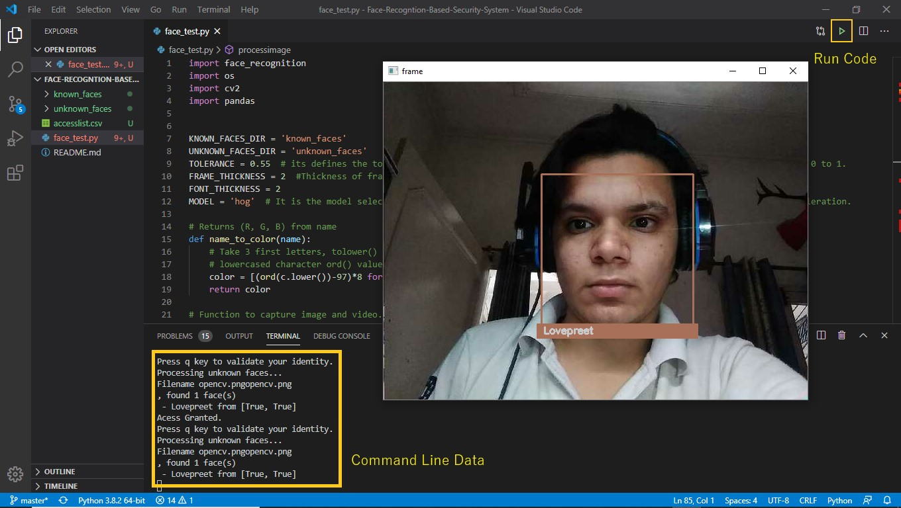

# Face-Recogntion-Based-Security-System

This project is based on Pyhton's OpenCV library which does the work of computer vision. In this project a Opencv is set up to detect Human faces and recognising them as an individual person by showing their names also. The machine learning model is trained by providing some pictures of that person and our machine recognise the face in real time using Webcam or any related camera device and shows the name by drawing a recatngle on the face.   



## Required Libraries 
1. cv2                ```python 
                      pip install opencv-python
                      ```
2. face_recognition   ```pyhton
                      pip install face-recognition
                      ```
3. pandas             ```pyhton
                      pip install pandas
                      ```
4. dlib               ```python
                      pip install dlib
                      ```
#### Note- If any problem occur installing dlib library follow this link- https://www.youtube.com/watch?v=TC_LPpa7uj0 

## Respository specifications
1. Known_faces folder is used to store the pictures of a person inside a folder that carrying his name.These picrtures used for face recognition or as training set.
2. Unknown_faces generally it is a temperary folder which contains the captured image. **try not to do anything with this,its is used by the code to save temp catured images**
3. accesslist.csv It is used to store names of person you want to give access by specifying Yess (Y) or No (N).Also add that persons pictures by creating a folder in known_faces folder as already shown.
4. face_test.py It is the main python script run it in the command propt or by using VS Code software.


## How to use 
1. Clone or download the files to your pc.
2. Add your images to known_faces folder by creating a new folder inside known_faces folder. Created folder contains your images as jpg and that folder name should be your name.
3. Add your name inside **Accesslist.csv** and also write Y for access garnt and N for No access grant.
4. Run the Code in command propt.As command in picture-


